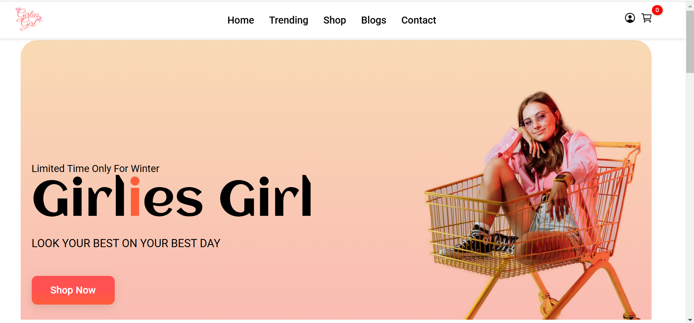

# Girlies Girl – E-Commerce Website

A responsive frontend e-commerce application built with HTML, CSS, and JavaScript.  
Designed with a feminine aesthetic and Focused on clean UI design, modular structure, and dynamic client-side functionality.

## Overview

Girlies Girl is a UI-focused shopping platform that simulates real-world e-commerce behavior using client-side rendering and local storage for state management.

The project emphasizes structured code organization, reusable components, and responsive design.

## Features

- Dynamic product rendering
- Add to cart functionality
- Cart state persistence using localStorage
- Responsive layout (mobile & desktop)
- Modular JavaScript structure
- JSON-based product data management

## Tech Stack

- HTML5
- CSS3 (Flexbox, responsive design)
- JavaScript (ES6)
- JSON (product data)
## Screenshots

<img src="screenshots/cart.png" width="300"/

## Key Concepts Demonstrated

- DOM manipulation
- Client-side state management
- Data-driven UI rendering
- Separation of concerns
- Responsive UI engineering

## Author

Andleeb Razzaq  
Frontend Developer

